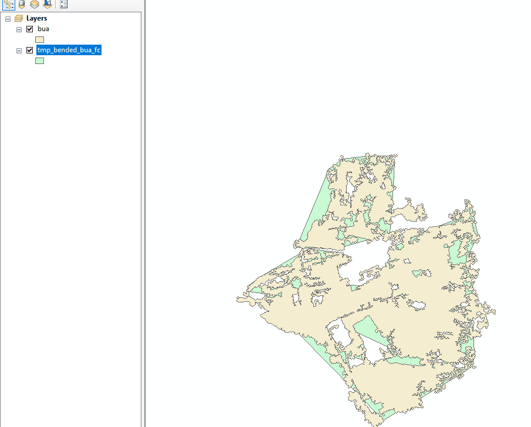
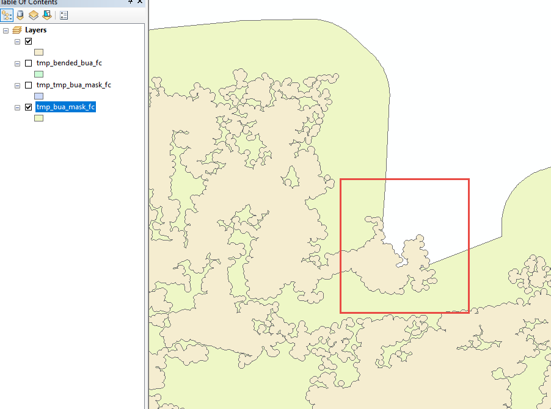
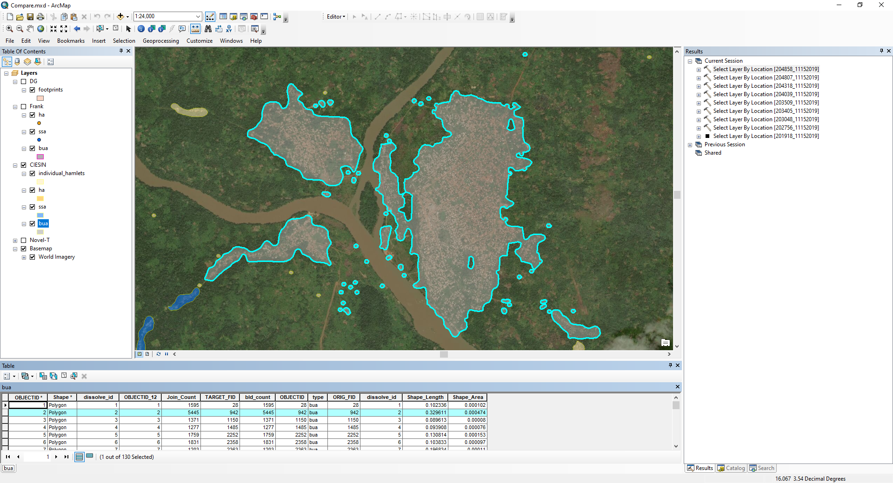
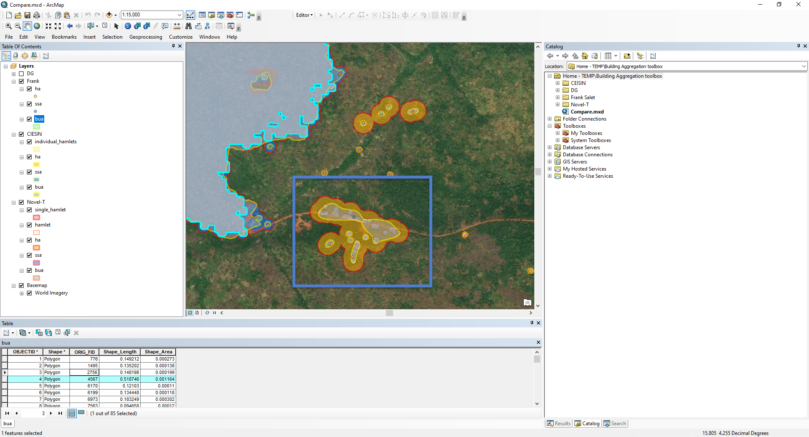

# Intended Consumer

Public Health Activities that require settlements (Vaccination campaigns, surveillance, etc.) 

## Output

* File GDB containing the 4 aggregated settlement layers (polygon)

* (TODO Able to release?  License issues?) A building count model (raster at 100m precision. Each cell containing a value representing the number of buildings in that cell)

## Derived Products

An aggregated settlement layer (point)

A neighborhoods type layer (polygon)

A GIS-based population model (raster at 100m precision)

# Business Rules

## Create 4 feature classes (SSA / BUA / HA / hamlets)

Classify the settlements into 

1. Cities/Built Up Areas (BUA)
2. Rural Villages/Small Settlement Areas (SSA) 
3. Hamlet Areas (HA) which are clusters of hamlets which are within 200m from one another

The hamlets are included as well, serving as an input to HA 

## Represent settlements as polygons and points

Note currently the point (centroid) representation is not generated.  This however is derivable from the Polygon.

## All of the building footprints must fall within the resulting settlement polygons

An algorithm to verify this --

1.  Find all centroids of building footprints
2.  Verify these centroids intersect exactly 1 settlement

## 99% of the centroid of the cells of the WorldPop “grid cell surface area per country (time-invariant)”, which intersect one or more buildings, must fall within the resulting settlement polygons

An algorithm to verify this --

1.  Find all raster squares that contain the centroid of building footprints
2.  Check these building footprints centroids are inside a single settlement
3.  Check the raster square centroid also intersects this same settlement

## Attributes

Useful attributes must be retained from the building footprints layer 

* number of buildings
* avg size of building
* min/max/avg/total building area
* proportion of settled area
* avg/min/max distance between buildings

## Projection calculations 

The computation of attributes, requiring the building footprints to be projected, must be calculated using the most accurate projection, based on the UTM coordinate system/Zone and the location of the building footprints

## DG/Maxar EULA

Legal requirements of this EULA should be respected.  Digital Globe / Ecopia provided the imagery and building footprint layer

## [Requirement under review] Holes (areas enclosed in a settlement polygon)

“Holes” of certain size within the resulting settlement polygons must be retained (e.g. Bangui airport “hole” in the Bangui BUA polygon is retained), but which size
22’500 m2 (150m x 150m) vs. 5’000 m2 (70m x 70m)

## [Requirement under review] Thresholds for settlement types/classification
Impact of over/under-classifying one or the other (population modeling)
Will we ever be able to come-up with thresholds which will work in all countries?

## [Requirement under review] Produce multiple aggregated settlement layers

E.g.: Non/less-buffered polygon settlements (for high precision topographic mapping)

# Non Verifiable Requirements

* Have as few individual features as possible (e.g. if a Hamlet or an SSA is within X meters from a BUA it is combined with the BUA polygon to form a multi-part polygon)

* When overlaid on top of imagery the settlements match the settlement types definitions

* the collected settlement points with a Lat/Lon and a name would intersect the settlements.

* How good settlement classifications pass human review

Review with satellite imagery, capture ambiguous cases to build up test input sets

# Settlement descriptions

## Small Settlement Areas (SSAs)

Groups of at least 50 buildings are considered SSAs.  Buildings are grouped using contours of the reference raster, so buildings 
within adjacent squares are grouped together.

Note for historical reasons, the Nigeria GDB (used in VTS), used the following rule:
* rural villages with 20-100 residences

## Built Up Areas (BUAs)

Groups of at least 3000 buildings and an area of at least 400,000 m² are considered BUAs 

Note for historical reasons, the Nigeria GDB (used in VTS), used the following rule:
* urban areas with more than 100 residences 
* a gridded layout.  

## Hamlets / Hamlet Areas

Everything not considered an SSA nor a BUA is a hamlet. 

Hamlets themselves are buffered 25m.  Meaning the hamlets boundary should be at least 25m from any building center.

(Q -- what happens if a building is larger than 25m in any 2d dimension?)

Hamlets within 75m of one another are joined together to form a Hamlet Area.  Isolated hamlets are also
included in Hamlet Areas.  Thus hamlets, geometrically, are fully contained by a hamlet area.

Thus, a hamlet area will include at least 100m from any individual buildings centroid 

Hamlet areas that intersect SSAs or BUAs due to buffering will be removed from the HAs.

Note for historical reasons, the Nigeria GDB (used in VTS), used the following rule:
* Clusters of hamlets within 200m range from one another
* Hamlets contained less than 20 residences

# Technical description of algorithm

## Contour method

[TODO Include screenshots to see raster & contour shapes as well as other steps]
[TODO Verify steps are up to date]

Process

| Step name        | Description          | 
| ------------- |:-------------:|
| Building footprints with a UTM projection | As received from BMGF |
| Merge UTM files and project to an equal area projection | I use area to calculate BUA's 
| Convert BF to points | points are faster to work with, shape value should be maintained
| Convert points to raster | The raster value is the sum of the buildings using a 100m grid.
| Create shell up contours | Contours are created at intervals of two using as shell-up polygons. These are NOT donuts.
| Choose the appropriate contour | Contours provide a toolbox to work with for creating settlements. I generally find that a contour with the value of one and up works best, but some countries may show better results with the contour value of two and up. 
| Convert multi-part contour to single-part | This step generates the individual settlement contours
| Drop small contours | A downfall of using raster data is that small settlements are not represented well.  All settlements with 20 or fewer buildings are dropped
| Buffer small settlements | Any building point that does not intersect a contour is buffered and dissolved. To create smaller settlements
| Pick SSA | I start by picking SSA's based on a flat value of 50 buildings per settlement. This number is subjective and can be raised or lowered.
| Pick BUA's | BUA's seem to be the hardest settlement type to define. It is not just a factor based on the number of buildings but also requires a certain density.  Contours provide a toolbox to help define a BUA. For CAR I found that contours with the value of 15 and up that are larger than 250,000 meters square seem to capture BUA's. This process can change from country to country.
| Pick hamlets | Any settlement that is not an SSA or BUA is defined as a hamlet. In this case, it would be settlements with less than 50 buildings
| Final BUA | Holes larger than 5000 meters square are removed and BUA's are copied to a new GDB. Smoothing is not performed on BUA's since it is not needed and can cause geometry errors.
| Final SSA | Holes larger than 5000 meters square are removed, the geometry is smoothed and copied to a new GDB
| Final Hamlet | The geometry is smoothed and copied to a new GDB
| Hamlet Areas | Hamlets have a 200 meter buffer applied and dissolved
| Multi-part BUA's created | Hamlets and SSA's that fall within 1000 meters of a BUA are joined to that BUA as a multi-part polygon
| Multi-part SSA created | Hamlets within 500 meters of an SSA are joined to the SSA as a multi-part polygon
| Multi-part Hamlet Groupings created | Hamlets within 200 meters of each other are joined into a multi-part polygon.
| Reproject to WGS84 | Prep for distribution
 
## Satellite Settlements

The intention here is that settlements that are close to each other should be combined.

For BUAs, SSAs and HAs that intersect a buffered simplified polygon of the BUA are added to the BUA.  The result is
a multipolygon.

For SSAs, HAs are included similar to above.

For HAs, this is not done since HAs themselves are aggregated hamlets. 

Steps (for SSAs and BUAs)

1.  Settlement polygon is "Bent"

2.  SSA and BUA masks are created

These are 500m dissolved buffers of the bent settlements

3.  For BUA, any HA or SSA intersecting a mask is made into a BUA

4.  For SSA, any HA intersecting a mask is made into a SSA

5.  BUAs are then fused according to the mask with which they share the most area

As you can see, it is not assured that a BUA mask fully contains the BUAs within

## Future improvements

1.  Manual feedback mechanism.  

No matter how good automated processes are, manual feedback is important.  For example, certain settlements can be accepted as input and used to inform the next set of generated settlements.

This can also take into account existing official databases.

An example:

Is this one BUA?

Or a mixed of BUAs and several SSAs

2.  Satellite settlement ambiguity 

Is this an SSA, an HA or does it belong to the nearby BUA?

